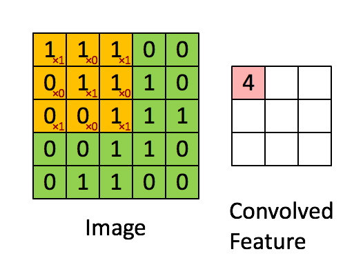

# Convolutional Neural Networks in rice disease detection

## Components for the convolution.

### Kernel.
A kernel in a convolutional neural network it's just a simple filter 
able to cycle through each pixel photo, although a filter has different things
about kernel. A Kernel is a matrix

## Hyper parameters layers

### **Input image(s):** Target images you'd like to discover patterns in

### **Input layer:** Takes in target images and preprocesses them for further layers

### **Convolution layer:** Extracts/learn the most important features from target images

### **Hidden activation/non-linear activation:** Adds non-linearity to learned features (non-straight lines)

### **Pooling layer:** Reduce the dimensionality of learned images features.

### **Output layer:** Takers learned features and outputs them in shape of the target labels

### **Output activation:** Convert output logits to prediction probabilities

This is how looks the architecture:

